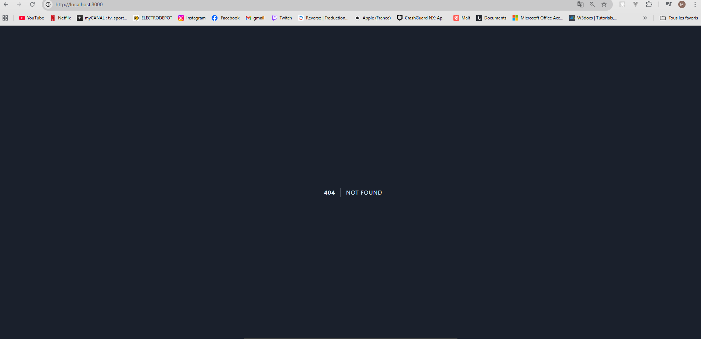

# Documentation technique Wizia back-end 

## introduction du back-end de wizia

Ce readme servira au lancement de back-end de wizia 

## prérequis pour le lancement du projet 

- Docker 
- docker compose 

## Lancement du projet

```
git clone https://github.com/MatthieuQuerel/Lean_Start_UP_WIZIA
cd ./Lean_Start_UP_WIZIA
cp ./.env.example ./.env
docker network create public
docker compose up -d
```
Attention, veuillez attendre un peu, cela peut prendre un peu de temps.



L'accès au backend de l'application se fait sur [http://localhost:8000](http://localhost:8000)
Le visuel sur la base de données est accessible depuis [http://localhost:8081](http://localhost:8081), avec les identifiants enregistrés dans le fichier docker_build/.env


lien vers [l'architecture du projet](./docs/architecture.md)


