# Architecture du projet

## Pipeline GitHub 

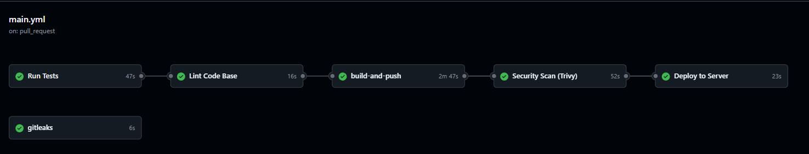
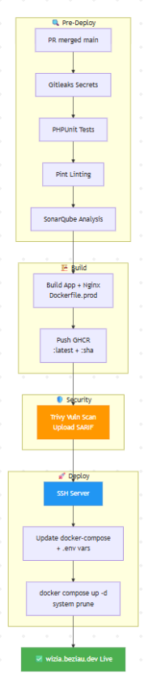

## Justifiacation de la Pipeline GitHub

- GitHub
    - Gratuit (pour les dépôts publics et privés)
    - Automatisation CI/CD (via GitHub Actions)
    - Outils Open Source et immense communauté
    - Outils performants et scalables
    - Gestion des secrets 
    - Revue de code collaborative 

- SonarQube
    - Détection de bugs et de vulnérabilités
    - Vision sur la qualité du code (dette technique et couverture de tests)
    - Open source avec une version gratuite (Community Edition)
    - Outil performant pour l'analyse statique (SAST)
    - Analyse des "Code Smells" (mauvaises pratiques)

- Docker
    - Conteneurisation d'applications
    - Duplication et isolation des environnements de développement
    - Standardisation des déploiements 
    - Écosystème riche avec Docker Hub

- Pint 
    - Utilisation pour le linting et le formatage automatique
    - Simple de configuration
    - Gratuit et léger
    - Basé sur PHP-CS-Fixer

- GitLeaks
    - Détection de vulnérabilités (recherche de clés API ou mots de passe)
    - Prévention des fuites de données avant le "commit" 

- Trivy 
    - Scan de vulnérabilités dans les images Docker et packages OS
    - Analyse de l'Infrastructure as Code 
    - Détection de mauvaises configurations de sécurité

- Snyk
    - Détection de vulnérabilités dans les dépendances open source
    - Simple à mettre en place avec des rapports détaillés
    - Monitoring continu et propositions de correctifs automatiques

## Justifiacation par image

### Documentation API

Pour faciliter la collaboration avec l'équipe Front-end, nous avons généré une documentation interactive. Elle permet de tester toutes les routes du projet en temps réel.

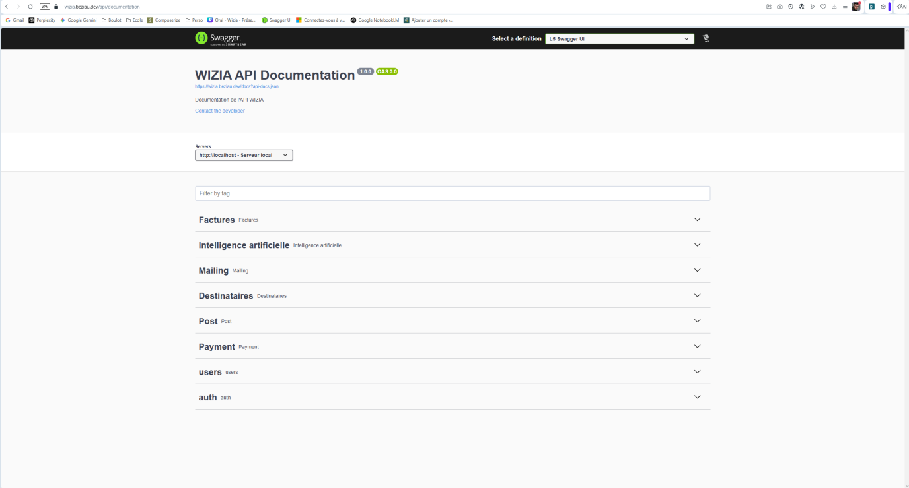

[Lien swagger](https://wizia.beziau.dev/api/documentation)
 
### Qualité avec SonarQube

SonarQube nous offre une vision globale sur la qualité du projet , en isolant les bugs critiques et en suivant l'évolution de la qualité au fil des sprints.

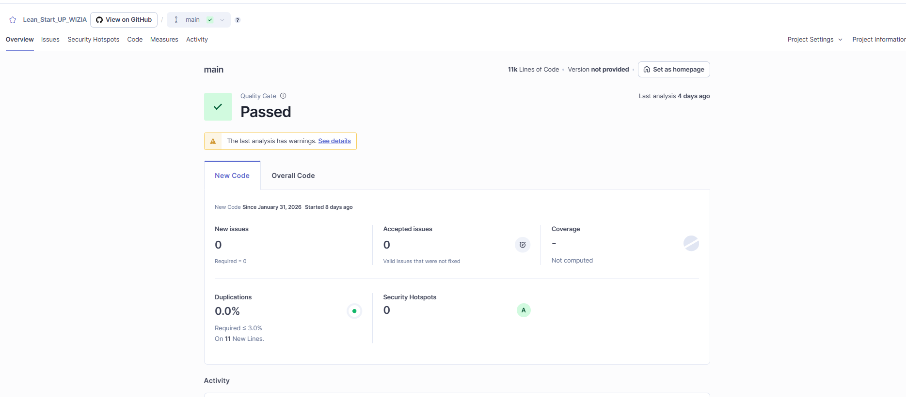
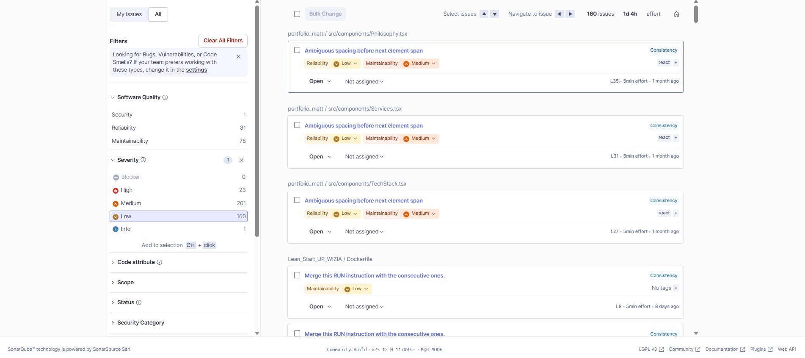


### Sécurité des Dépendances avec Snyk

Snyk surveille nos bibliothèques externes pour s'assurer qu'aucune faille connue n'est introduite dans l'application.

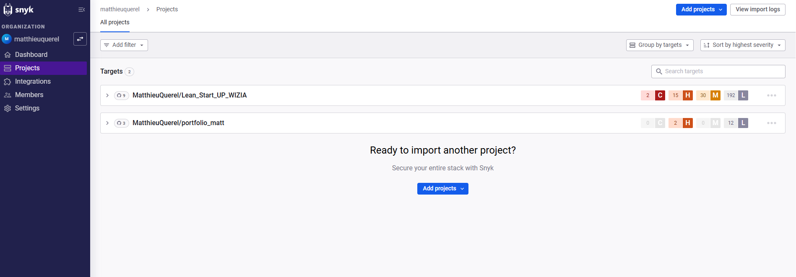
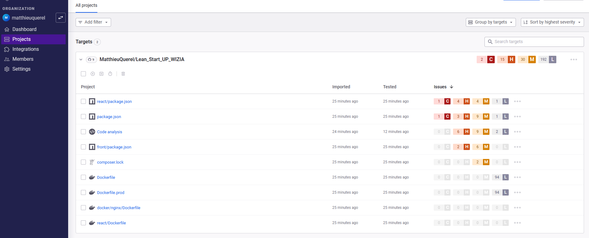


### Transition de GitGuardian vers GitLeaks

Initialement, nous utilisions **GitGuardian** pour la détection de secrets. Cependant, nous avons opté pour **GitLeaks** pour son intégration plus fluide  et sa performance en ligne de commande qui s'adapte mieux à nos besoins actuels.

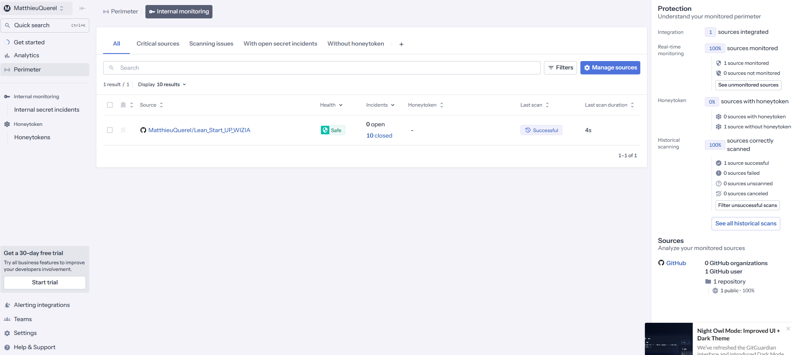

### GitHub

Pour garantir la stabilité de la branche principale, nous avons mis en place des règles strictes : l'interdiction de "push" directement sur la branche de production et l'obligation de passer par une Pull Request. Pour être fusionnée, chaque modification doit être impérativement revue et validée par Dimitri ou moi-même

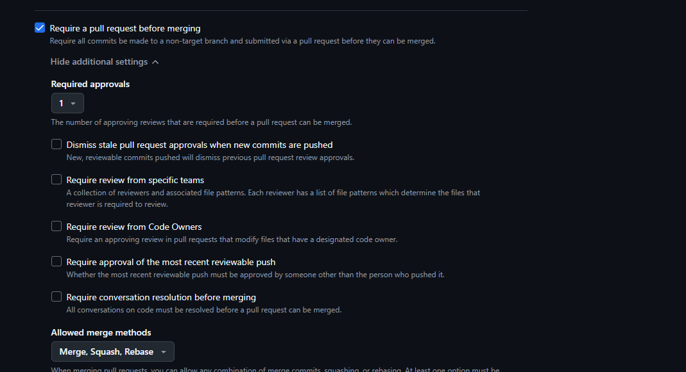
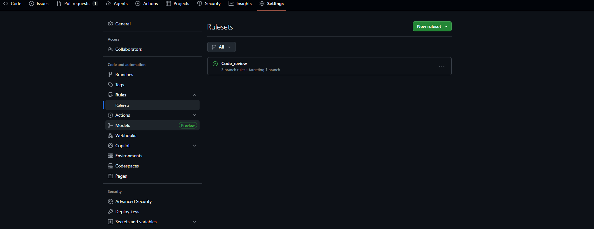


### Application accessibilité

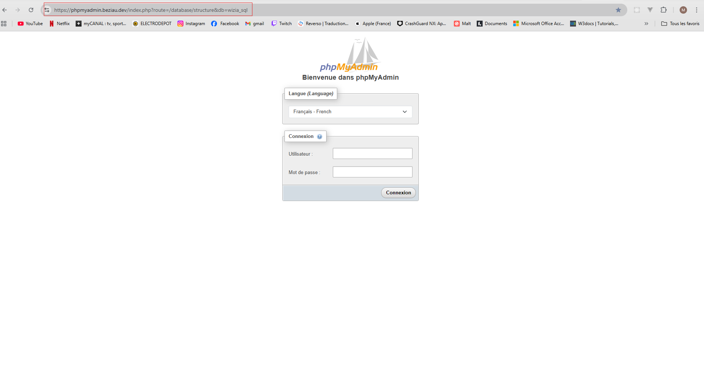

### Monitoring

Pour assurer la haute disponibilité de notre application et suivre ses performances en temps réel, nous avons choisi Grafana comme outil de visualisation. Pour surveiller les métriques clés du système et pour investiguer rapidement les erreurs de l'application.

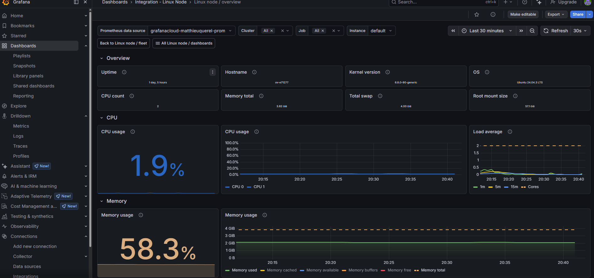
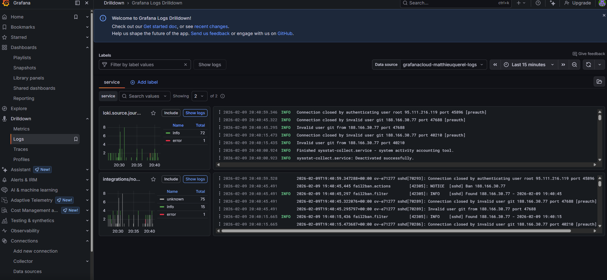

### Code Scan GitHub

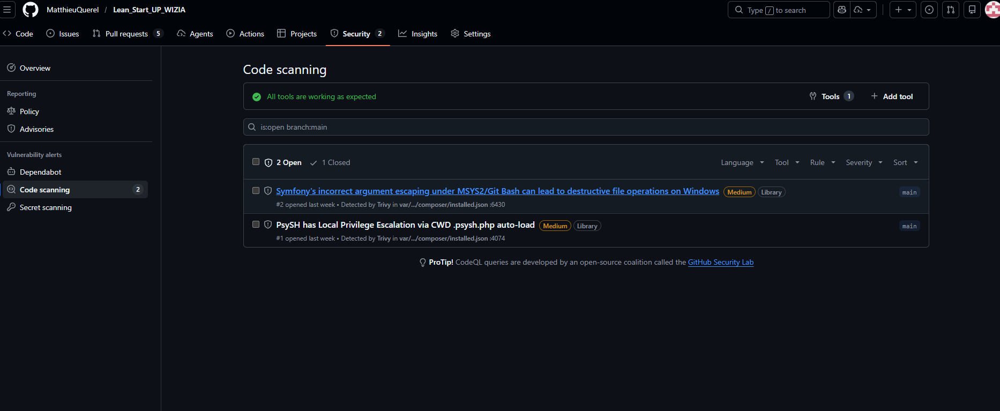

## Rollback

En cas d'échec d'une mise en production, voici la procédure à suivre pour revenir à un état stable.

### 1. Identifier la version précédente (image Docker)

Chaque image Docker poussée sur le GitHub Container Registry (GHCR) est taguée avec le **SHA du commit** en plus du tag `latest`. Cela permet de revenir à n'importe quelle version précédente.

Pour lister les images disponibles :

```bash
# Sur le serveur de production, lister les images disponibles
docker images ghcr.io/dimibeziau/wizia/app
docker images ghcr.io/dimibeziau/wizia/nginx
```

Le tag suit le format `sha-<7 premiers caractères du commit>`, par exemple `sha-a1b2c3d`.

### 2. Rollback des conteneurs Docker

Se connecter en SSH au serveur de production et exécuter :

```bash
cd /home/<user>/DockerApps/Lean_Start_UP_WIZIA

# Modifier le docker-compose.yml pour pointer vers l'image précédente remplacer le tag 'latest' par le tag SHA de la version stable
# Exemple : ghcr.com/dimibeziau/wizia/app:sha-a1b2c3d

# Puis redémarrer les conteneurs
docker compose down
docker compose up -d
```

Alternativement, si l'image `latest` précédente est encore en cache local :

```bash
# Forcer le pull de l'image précédente par son tag SHA
docker pull ghcr.io/dimibeziau/wizia/app:sha-<commit_sha>
docker pull ghcr.io/dimibeziau/wizia/nginx:sha-<commit_sha>

# Stopper et relancer avec les anciennes images
docker compose down
docker compose up -d
```

### 3. Rollback des migrations de base de données

Si la mise en production incluait des migrations Laravel qui ont échoué ou causé des problèmes :

```bash
# Entrer dans le conteneur applicatif
docker exec -it wizia-app bash

# Annuler la dernière migration
php artisan migrate:rollback --step=1

# Ou annuler plusieurs migrations (ex: les 3 dernières)
php artisan migrate:rollback --step=3

# Vérifier l'état des migrations
php artisan migrate:status
```

> **Attention** : Le rollback de migrations ne fonctionne que si les méthodes `down()` sont correctement implémentées dans chaque fichier de migration.

### 4. Rollback via Git (re-déploiement)

Si le rollback manuel est trop complexe, la méthode la plus sûre est de **revert le commit** fautif et relancer le pipeline :

```bash
# En local, revert le dernier commit mergé
git revert HEAD
git push origin main

# Le pipeline GitHub Actions se relancera automatiquement
# et déploiera la version corrigée
```

### 5. Procédure d'urgence

En cas de panne critique nécessitant une action immédiate :

```bash
# 1. Mettre l'application en mode maintenance
docker exec -it wizia-app php artisan down --secret="<token-urgence>"

# 2. Diagnostiquer le problème
docker logs wizia-app --tail=100
docker logs wizia-web --tail=100

# 3. Une fois le rollback effectué, remettre en ligne
docker exec -it wizia-app php artisan up
```

### Résumé des commandes clés

| Situation | Commande |
|---|---|
| Voir les images disponibles | `docker images ghcr.io/dimibeziau/backend_wizia/app` |
| Rollback conteneurs | `docker compose down && docker compose up -d` |
| Rollback 1 migration | `docker exec -it wizia-app php artisan migrate:rollback --step=1` |
| Mode maintenance | `docker exec -it wizia-app php artisan down` |
| Fin maintenance | `docker exec -it wizia-app php artisan up` |
| Revert Git | `git revert HEAD && git push origin main` |

---

Explication de la démarche DevSecOps [DevSecOps](./DevSecOps.md)

